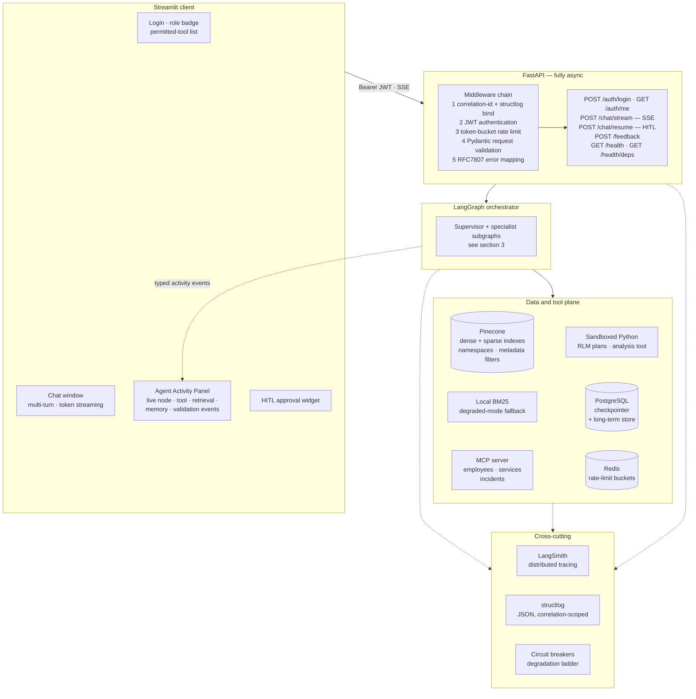
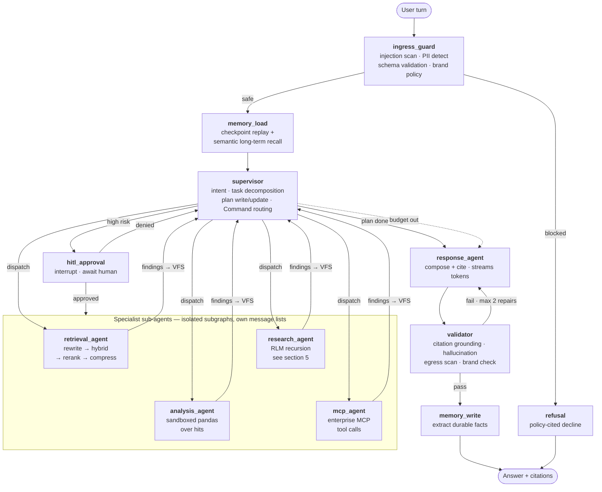
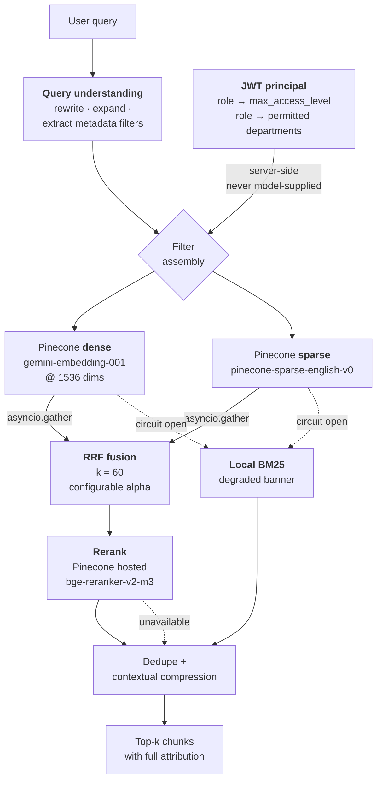
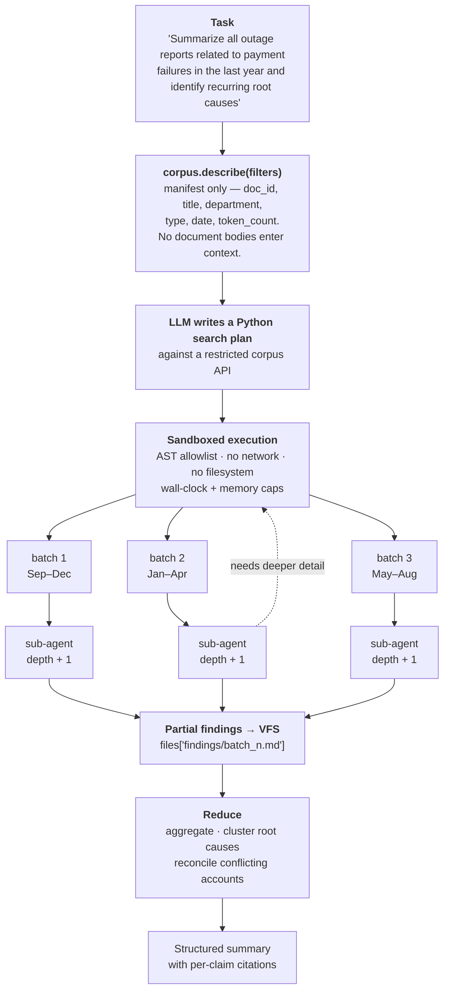
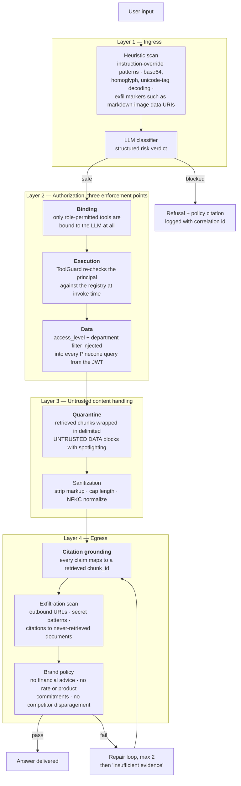
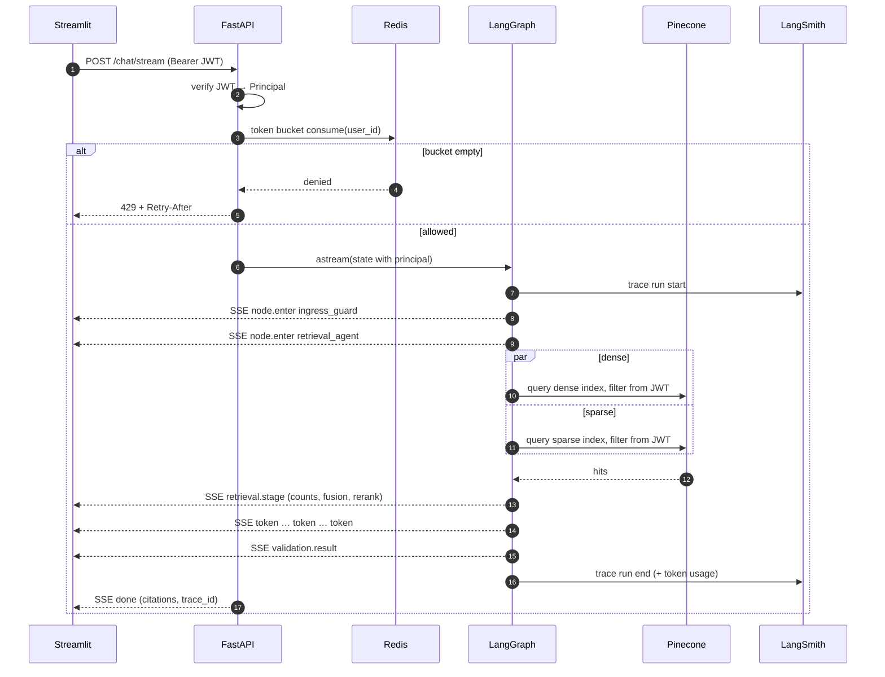
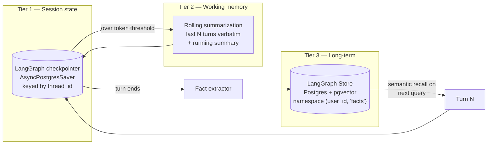
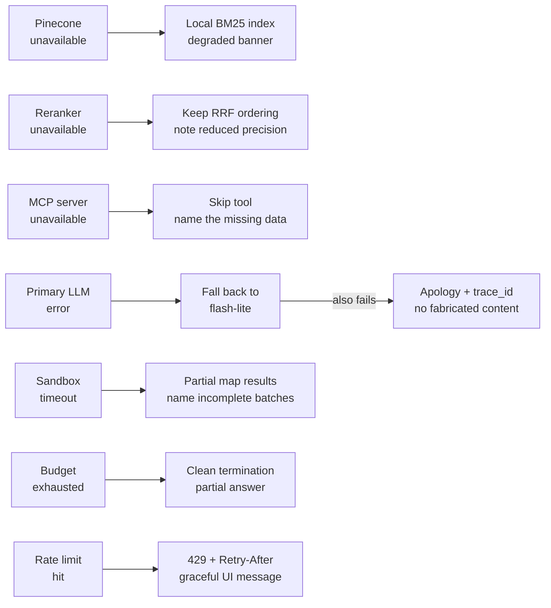
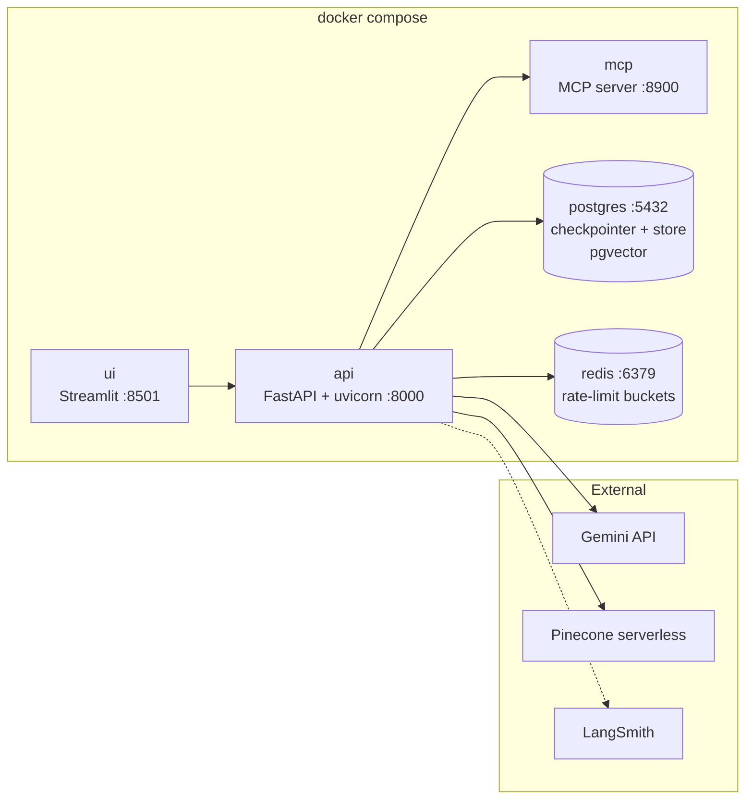

# Architecture

Enterprise AI Assistant — a multi-agent, retrieval-grounded conversational system over
organizational knowledge, built for **Commercial Bank** as the operating persona.

> **Design thesis.** The interesting engineering in a system like this is not "LLM + vector DB".
> It is everything around that edge: how work is decomposed, how context is kept small, how
> authorization survives a compromised model, how the system behaves when a dependency dies,
> and whether a human can see what happened afterwards. Every diagram below is organized
> around one of those questions.

**Contents**

1. [Design principles](#1-design-principles)
2. [System layers](#2-system-layers)
3. [The agent graph](#3-the-agent-graph)
4. [Retrieval architecture](#4-retrieval-architecture)
5. [Recursive Language Model](#5-recursive-language-model-rlm)
6. [Security control points](#6-security-control-points)
7. [Request lifecycle](#7-request-lifecycle)
8. [Memory design](#8-memory-design)
9. [Model routing](#9-model-routing)
10. [Failure model](#10-failure-model)
11. [Deployment topology](#11-deployment-topology)

---

## 1. Design principles

| # | Principle | Where it shows up |
|---|---|---|
| P1 | **Authorization lives in the data path, never in the prompt.** | Access filters are injected into every Pinecone query from the verified JWT ([§4](#4-retrieval-architecture), [§6](#6-security-control-points)) |
| P2 | **Context is a budget, not a bucket.** | Sub-agent isolation, VFS scratchpad, RLM manifests, memory compaction ([§3](#3-the-agent-graph), [§5](#5-recursive-language-model-rlm), [§8](#8-memory-design)) |
| P3 | **Every internal state transition is observable.** | Typed activity events on the same stream as answer tokens ([§2](#2-system-layers), [§7](#7-request-lifecycle)) |
| P4 | **Degradation is a designed behaviour, not an exception path.** | Explicit ladder, each rung surfaced to the user ([§10](#10-failure-model)) |
| P5 | **Retrieved text is data, never instruction.** | Quarantine + spotlighting of all retrieved content ([§6](#6-security-control-points)) |
| P6 | **An unsupported claim is a bug.** | Validator enforces per-claim citation grounding with a repair loop ([§3](#3-the-agent-graph)) |

---

## 2. System layers



The **Agent Activity Panel is a product surface, not a debug view.** Answer tokens and internal
state transitions travel the same SSE connection, so what the evaluator watches is the actual
execution, not a reconstruction after the fact.

---

## 3. The agent graph



### Deep-agent patterns, hand-built

The spec names "Deep agents". Rather than adopting a framework abstraction, each pattern is
implemented directly on `StateGraph` so that every transition is inspectable and streamable:

| Pattern | Implementation |
|---|---|
| **Planning** | Supervisor writes a todo list into `state.plan`; each dispatch marks progress. Rendered live in the activity panel. |
| **Sub-agent isolation** | Each specialist is a compiled subgraph with its *own* `messages` list. Only distilled findings return to the parent — the parent context never sees raw tool output. |
| **Virtual filesystem** | `state.files: dict[str, str]` scratchpad. Sub-agents write artifacts and pass *filenames*, not contents. |
| **`Command` routing** | Supervisor returns `Command(goto=..., update=...)`. Routing becomes model-produced data visible in the trace, not a hidden edge table. |
| **Explicit budgets** | `depth`, `tool_calls`, `tokens` live in state. Exhaustion is a normal terminal transition into `response_agent` with a partial answer — never an exception. |

### State

```python
class AgentState(TypedDict):
    messages: Annotated[list[AnyMessage], add_messages]
    principal: Principal  # user_id, role, allowed_tools, max_access_level
    plan: list[TodoItem]  # deep-agent planning
    files: dict[str, str]  # VFS scratchpad — artifacts by name
    retrieved: list[Chunk]
    citations: list[Citation]
    risk: RiskAssessment
    budget: Budget  # depth / tool_calls / tokens remaining
    errors: list[ErrorRecord]  # degradations, surfaced to the UI
```

`principal` is written **once**, by the API layer, from the verified JWT. No node and no model
output can mutate it — this is what makes [§6](#6-security-control-points) layer 3 sound.

### Streaming

The graph runs under `astream(stream_mode=["messages", "updates", "custom"])`. Nodes emit
activity events through `get_stream_writer()`; the API multiplexes them into a single SSE stream:

| Event | Emitted by | Panel rendering |
|---|---|---|
| `node.enter` / `node.exit` | every node | current-state breadcrumb |
| `plan.update` | supervisor | live todo checklist |
| `tool.call` / `tool.result` | tool guard | tool name, args digest, latency, allow/deny |
| `retrieval.stage` | retrieval agent | dense/sparse counts, fusion, rerank deltas |
| `memory.read` / `memory.write` | memory nodes | recalled facts, written facts |
| `validation.result` | validator | grounding score, repair attempts |
| `degradation` | resilience layer | which rung of the ladder fired, and why |
| `token` | response agent | streamed answer text |

---

## 4. Retrieval architecture



### Why two indexes rather than one dot-product index

Pinecone supports both shapes. A single index holding dense + sparse vectors is simpler, but
separate indexes are the documented path when you want the **integrated
`pinecone-sparse-english-v0` model** and **independent reranking** — and we want both. The
practical win is explainability: fusion becomes an explicit, inspectable step rather than a
server-side score blend the demo cannot show.

### Why RRF rather than weighted score blending

Dense cosine similarity and learned-sparse scores are not on a comparable scale, so a weighted
sum needs a normalization step that is itself a tuning liability. Reciprocal Rank Fusion consumes
only rank order:

$$\text{RRF}(d) = \sum_{r \in \text{retrievers}} \frac{1}{k + \text{rank}_r(d)} \qquad k = 60$$

`alpha` stays configurable so the demo can show the dense↔sparse trade-off live.

### Chunking and metadata

Chunking is heading-aware — roughly 800 tokens with 120 overlap, split on structural boundaries,
retaining a `heading_path` so a citation points at *"Incident 2025-114 → Root Cause Analysis"*
rather than an opaque byte offset.

| Field | Purpose |
|---|---|
| `department` | Namespace selector + filter |
| `document_type` | `policy` · `architecture` · `runbook` · `incident` · `product_spec` · `meeting_notes` |
| `access_level` | `public` < `internal` < `confidential` < `restricted` — the authorization lattice |
| `created_date` | Recency filters and the RLM's time-window batching |
| `doc_id`, `chunk_idx`, `heading_path`, `source_uri` | Attribution and citation rendering |

Namespaces partition by department: cheaper filtering, and a hard blast-radius boundary if a
filter is ever mis-constructed.

---

## 5. Recursive Language Model (RLM)

The point of RLM is that **the corpus is an environment the model queries, not a payload it
swallows.** The research agent never sees whole documents; it sees a manifest, writes code
against a restricted API, and recurses.



The restricted API the model codes against:

| Call | Returns |
|---|---|
| `describe(**filters)` | Manifest rows — metadata only, never bodies |
| `search(query, **filters)` | Ranked `chunk_id`s via the [§4](#4-retrieval-architecture) hybrid path |
| `filter(rows, predicate)` | Narrowed manifest |
| `get_chunk(chunk_id)` | One chunk body, counted against the token budget |
| `batch(rows, by=...)` | Partitions — by date window, department, or size |
| `map_llm(batch, instruction)` | Recursive sub-agent call, depth + 1 |
| `reduce_llm(findings, instruction)` | Aggregation over VFS artifacts |

**Recursion limits:** depth ≤ 3, fan-out ≤ 8, shared token budget. A timeout returns **partial
map results** rather than failing the turn — the answer says which batches completed. Every
recursion level is a nested LangSmith span, so the trace shows the tree literally.

---

## 6. Security control points



### Why authorization is enforced three times

Defence in depth against three different failure modes:

| Point | Defeats |
|---|---|
| **Binding** | The model cannot even *emit* a call it is not permitted to make — the tool is absent from its schema |
| **Execution** | State tampering, replayed calls, injected tool invocations that bypassed binding |
| **Data** | Retrieval-level leakage — works even if the model is **fully** compromised, because the filter is built from the JWT, not from anything the model produced |

The third point is the one that matters. A prompt injection can hijack a model's intent; it
cannot change what the vector database was asked to return.

### Roles

| Role | Chat | Knowledge search | MCP tools | Analytics | Admin tools |
|---|---|---|---|---|---|
| **Viewer** | ✅ | ✅ | ❌ | ❌ | ❌ |
| **Analyst** | ✅ | ✅ | ✅ | ✅ | ❌ |
| **Administrator** | ✅ | ✅ | ✅ | ✅ | ✅ |

Every tool in the registry declares `required_role`, `risk_level`, `timeout`, and `idempotent`.
`risk_level = high` routes through the HITL approval node regardless of role.

---

## 7. Request lifecycle



Every I/O boundary is `async`. Dense and sparse retrieval run under a single `asyncio.gather`;
RLM batch sub-agents fan out the same way, bounded by a semaphore set to the fan-out limit.

---

## 8. Memory design

Three tiers, each solving a distinct problem:



| Tier | Solves | Key decision |
|---|---|---|
| **Session state** | "Memory should survive multiple turns during a session" | Checkpointing full *graph state*, not just messages, so HITL resume and crash recovery come free |
| **Working memory** | Multi-turn cost growing quadratically | Compaction over truncation — a summary preserves early-turn constraints that naive windowing silently drops |
| **Long-term** | Cross-session personalization | Scoped to `(user_id, "facts")`. **Never crosses users**, and invalidated on role change so a downgraded user cannot read prior-role content out of memory |

The role-change invalidation is easy to miss and is a real leak: memory written while a user was
an Administrator would otherwise be replayed into context after they became a Viewer.

---

## 9. Model routing

One model does not fit every node. Routing is a single config table so the cost/quality
trade-off is explicit and demonstrable.

| Node | Model | Rationale |
|---|---|---|
| `ingress_guard`, `validator` | `gemini-3.5-flash-lite` | Pure classification, runs on every turn — cheapest and lowest latency |
| `supervisor`, `retrieval_agent`, `mcp_agent` | `gemini-3.5-flash` | Positioned by Google for agentic/tool-use workloads |
| `research_agent` (RLM), `analysis_agent` | `gemini-3.5-flash`, escalating to `gemini-3.1-pro-preview` on hard reduce steps | Long-horizon reasoning where answer quality dominates token cost |
| `response_agent` | `gemini-3.6-flash` | Latest GA balanced model; cheaper output tokens than 3.5 Flash |
| Embeddings | `gemini-embedding-001` @ **1536** dims | GA and stable. `gemini-embedding-2-preview` is preview *and* its embedding space is incompatible — adopting it would force a full re-embed later. MRL truncation 3072 → 1536 halves index cost at negligible quality loss |

---

## 10. Failure model

Every dependency call is wrapped in a circuit breaker, jittered exponential backoff, and an
`asyncio.wait_for` timeout. Degradation is a **designed ladder**, and each rung emits a
`degradation` event so the evaluator watches it happen:



The invariant across all of them: **the system never silently returns a worse answer.** Reduced
capability is always stated in the response and visible in the activity panel.

---

## 11. Deployment topology



Python is pinned to **3.12** via `uv`; the async `get_stream_writer()` path requires ≥ 3.11, and
3.14 does not yet resolve cleanly across this dependency set.

```bash
make up      # bring up all five services
make seed    # generate the mock corpus and index it into Pinecone
make test    # unit + integration + security suites
```

---

## Related documents

| Document | Contents |
|---|---|
| [`security.md`](./security.md) | Threat model, injection test corpus, guardrail specifications |
| [`assumptions-and-tradeoffs.md`](./assumptions-and-tradeoffs.md) | What was assumed, what was deliberately not built, and why |
| [`adr/`](./adr/) | Architecture decision records — LLM selection, hybrid retrieval, memory design, RBAC enforcement, RLM design |
| [`demo-script.md`](./demo-script.md) | Walkthrough order for the demo video, including the failure-injection steps |
